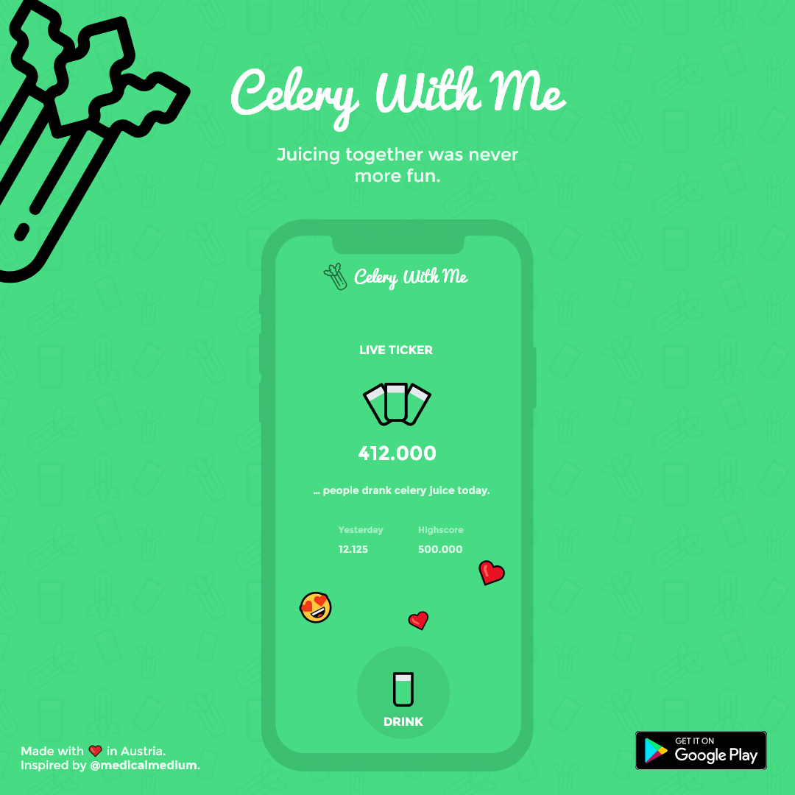

# Celery With Me 🥬

A mobile app (Android/iOS) for people drinking celery juice.
Highly inspired by @medicalmedium. 🥬🍓

## Features
- [x] user can see how many people drink celery juice daily (live-ticker)
- [x] user can see yesterday´s score and the current highscore
- [x] user can drink celery juice (max. once per day)
- [ ] user can see his longest streak of drinking celery juice (in days)  
- [ ] user can share emotes (max. 3 per day)
- [ ] use can see shared emotes in real-time (i.e. live)

## Technology
- 📱 Frontend: [Flutter](https://flutter.dev/)
  - using primarily Provider and ChangeNotifier 
- 🖥️ Backend: Node.js

## What I´ve learned from this project 🤓
- Building a custom backend with Node.js
- How to properly implement real-time client-server communication (WebSockets)
- That using BloC-Pattern for state-management in Flutter is often times overkill and ChangeNotifier with Provider works like a 
  charm for small to medium projects (also results in highly readable code imo)
- Writing highly-reusable animation widgets in Flutter  
- Implementing a custom AppBar in Flutter
- Implementing a custom animated score text (animates when the score changes) 
- Getting more used to the Git workflow
- Done is better than perfect (rly, just get startet; took me a while to understand this)

## Let´s create something together 🔥
I am a junior mobile developer who´s completing his Bachelors degree in CS this year. 
I love browsing good UI/UX and implementing my own ideas using Flutter.
I still have a lot to learn (Git collaboration, Backend dev, etc.) but am highly motivated.
Would be cool if I could join some project and learn a lot of things from experienced devs.
TODO: add contact deatails
